# Procesverslag
Markdown is een simpele manier om HTML te schrijven.  
Markdown cheat cheet: [Hulp bij het schrijven van Markdown](https://github.com/adam-p/markdown-here/wiki/Markdown-Cheatsheet).

Nb. De standaardstructuur en de spartaanse opmaak van de README.md zijn helemaal prima. Het gaat om de inhoud van je procesverslag. Besteedt de tijd voor pracht en praal aan je website.

Nb. Door *open* toe te voegen aan een *details* element kun je deze standaard open zetten. Fijn om dat steeds voor de relevante stuk(ken) te doen.

## Jij

  
uitwerken voor kick-off werkgroep

  ### Auteur:
  Arpine Sanajan

  #### Je startniveau:
  Blauw

  #### Je focus:
  Responsive
 

## Je website

  
uitwerken voor kick-off werkgroep

  ### Je opdracht:
  link naar de website die je gaat namaken óf de naam/omschrijving van je eigen ontwerp
  www.jamin.nl 

  #### Screenshot(s) van de eerste pagina (small screen): 
  hier de naam van de pagina  
  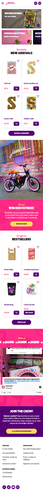

  #### Screenshot(s) van de tweede pagina (small screen):
  hier de naam van de pagina  
  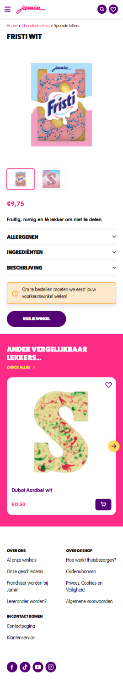
 

## Toegankelijkheidstest 1/2 (week 1)

  
uitwerken na test in 2e werkgroep

  ### Bevindingen
  Lijst met je bevindingen die in de test naar voren kwamen:
  - begon goed, website is responsive
  - heeft geen alt text voor afbeeldingen
  - pagina's hebben geen H1, in de footer opeens naar H6
  - niet alles heeft een focus state
  - niet elke link ziet eruit als een link
  - geen dark mode
  - geen high contrast mode

## Breakdownschets (week 1)

  
uitwerken na afloop 3e werkgroep

  ### de hele pagina: 
  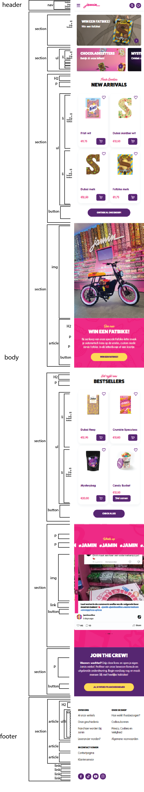

  ### dynamisch deel (bijv menu): 
  

## Voortgang 1 (week 2)

  
uitwerken voor 1e voortgang

  ### Stand van zaken
  hier dit ging goed & dit was lastig (neem ook screenshots op van delen van je website en code)
  Goed:
  - html opstellen
  - begin aan css
  - breakdownschets
  - afbeeldingen downloaden

  Lastig:
  - grid goed opzetten
  - fonts gebruiken
  - beginnen aan javascript

  ### Agenda voor meeting
  samen met je groepje opstellen

  | Arpine         | Omra               | Yenthe       | Laura            |
  | wanneer grid   | Hoe gebruik je nth | Aria labels  | afwezig|
  | en wanneer flex| type op css van    | en custom    | |
  |                | beide pagina's     | properties   | |
  |                | onderscheiden      |              | |

  ### Verslag van meeting
  hier na afloop snel de uitkomsten van de meeting vastleggen

  - articles voor kaartjes
  - grid voor kaartjes, flex voor naast elkaar (nav)
  - data element voor prijzen
  - aria label voor links

## Voortgang 2 (week 3)

  
uitwerken voor 2e voortgang

  ### Stand van zaken
 Moeite met carousel; plaatjes zijn verschillende groottes en grid lijkt een extra column te hebben zonder dat ik dit aangegeven had.

  ### Agenda voor meeting
  samen met je groepje opstellen

  Arpine: Hoe kan ik ervoor zorgen dat de plaatjes in de carousel dezelfde grootte zijn? Waarom krijgt de grid een extra column erbij als er niks in zit?

  Omra: Hoe krijg ik de h2 van sectie 4 onder de image? Op mobille is s5 een hele blok en op groter scherm aparte blokken, hoe doe je dit? Hoe verander je lettertype van a in adress?

  Yenthe: Hoe kunnen mijn afbeeldingen mee schalen zodat ze langer worden in de lengte? Hoe positioneren met display grid?

  Laura: Meerdere divs omdat ik het anders niet goed gepositioneerd krijg, mag dat? Hoe kan ik in mijn header met bepaalde breedte de svg in het menu wel en niet tonen, mag dit met display none? Bij mijn spotify section is er nog een kruisje die het sluit, moet dit werken> Hoe krijg ik deze rechts in de hoek gepositioneerd? Ik heb pijltjes in mijn carousel nodig maar die krijg ik niet gepoisitioneerd, hoe doe ik dit?

  ### Verslag van meeting
  Flex-basis en flex-shrink gebruiken voor li, afbeeldingen min-width en max-width geven. Grid heeft geen extra column, afbeelding neemt niet de hele breedte van de collumn in. Width = 100% maken om dit op te lossen.
  Nog te doen: light/darkmode

## Toegankelijkheidstest 2/2 (week 4)

  
uitwerken na test in 9e werkgroep

  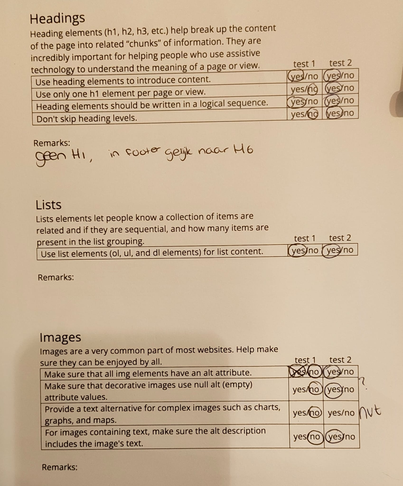
  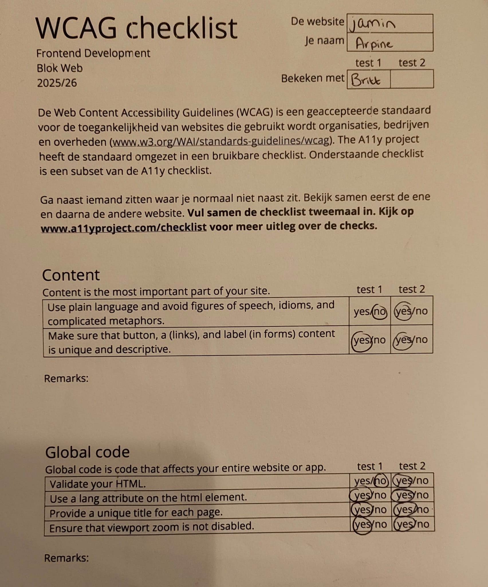
  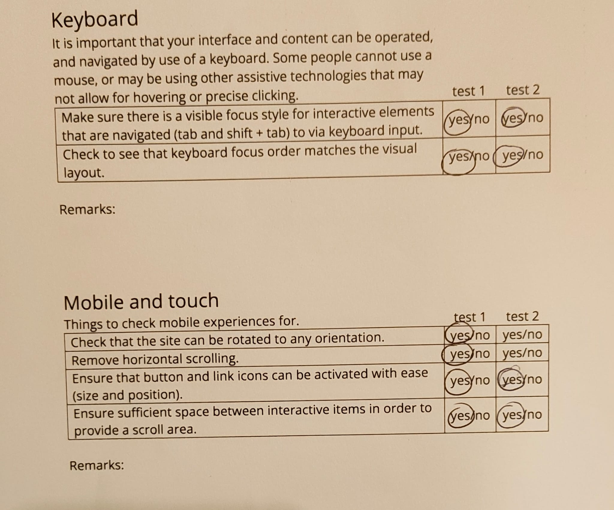
  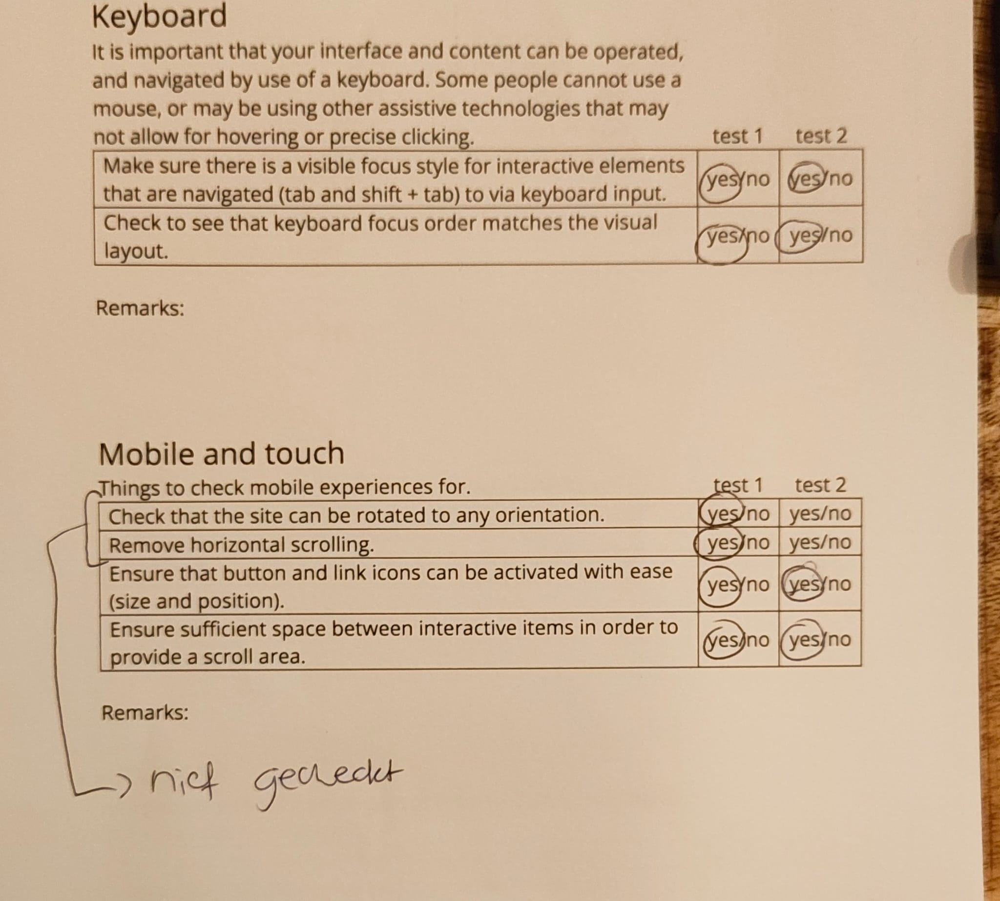
  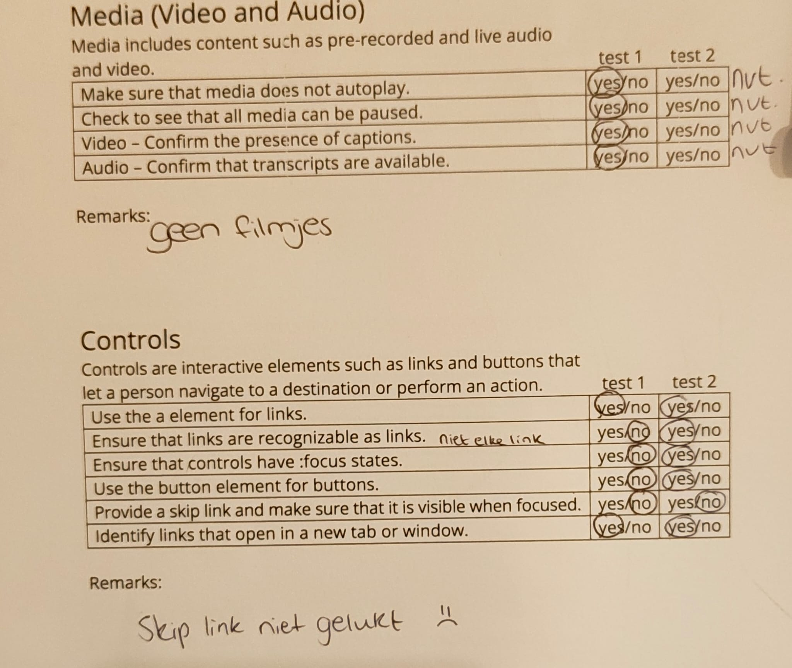
  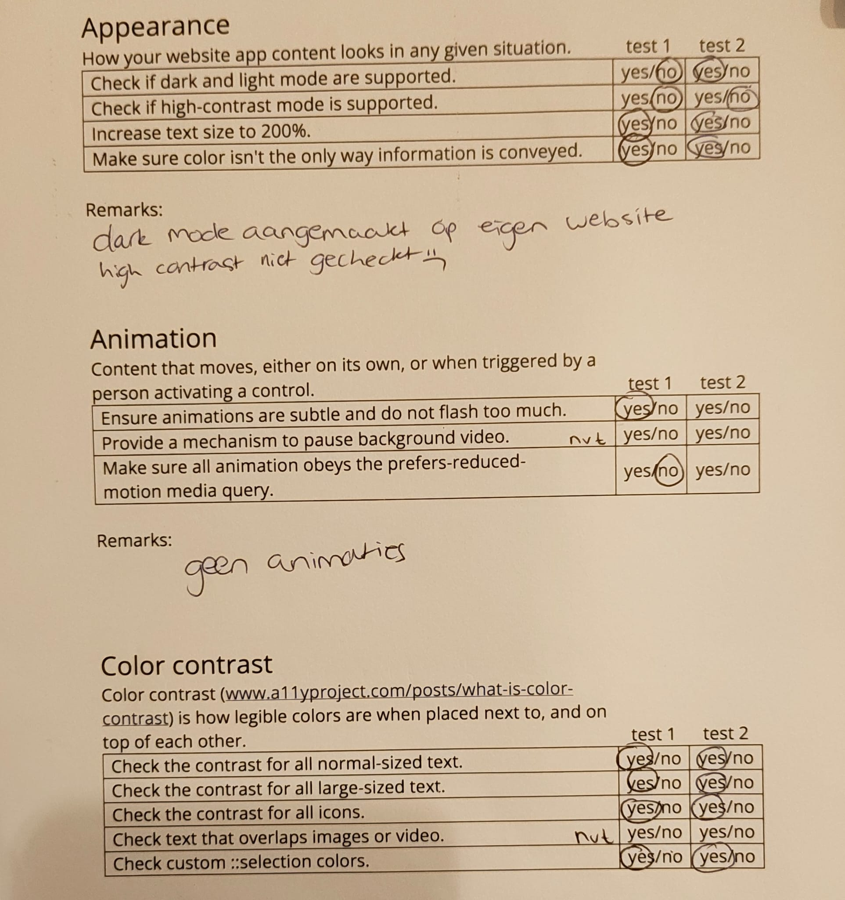

  ### Bevindingen
  Lijst met je bevindingen die in de test naar voren kwamen (geef ook aan wat er verbeterd is):

  Headings staan nu goed op volgorde, afbeeldingen hebben bijpassende alt tekst, links en buttons hebben aria labels.
  Dark-mode is toegevoegd

## Voortgang 3 (week 4)

  
uitwerken voor 3e voortgang

  ### Stand van zaken
  Carousel zag er nog niet goed genoeg uit, moeite met juiste elementen in css selecteren.

  ### Agenda voor meeting
  samen met je groepje opstellen

  Arpine: Kan een h3 en img ook als een link gemaakt worden en hoe doe je het dan met positioneren?

  Omra: Hoe krijg ik de carousel vakjes even groot? Hoe maak ik een border line langer? Hoe verwijder ik onnodige witruimte bij de p?

  Yenthe: Hoe gaat het scrollen bij mijn carousel weg? Hoe maak ik ruimte aan de linker en rechter kant van de 4 list items (header)? Grid in footer werkt niet?

  Laura: Het verwijderen van een element uit de DOM met js lukt me niet goed om responsive te maken. Ik heb 2 divs gebruikt voor makkelijke opmaak, hoe kan ik dit op een betere manier doen? Hoe download ik de svg code naar een img?

  ### Verslag van meeting
  hier na afloop snel de uitkomsten van de meeting vastleggen
  Goed op weg, gebruik juiste selectoren (a > h3 bijv), wees specifiek. Scroll weghalen met scroll overflow y = auto

  Te weinig tijd gehad om in meer diepgang te kijken naar mijn code, was als laatste aan de beurt en tijd was al voorbij 

## Eindgesprek (week 5)

  
uitwerken voor eindgesprek

  ### Je uitkomst - karakteristiek screenshots:
  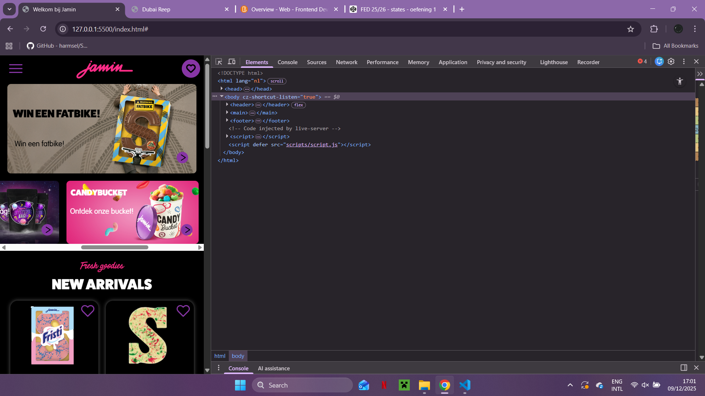

  ### Dit ging goed/Heb ik geleerd: 
  - Positioneren met grid 
  - Werkende hamburgermenu

  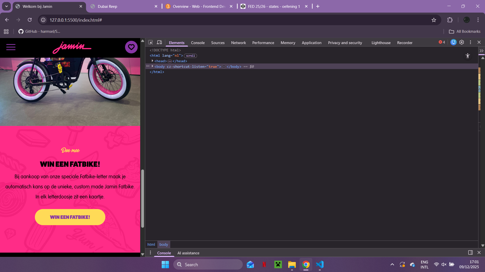
  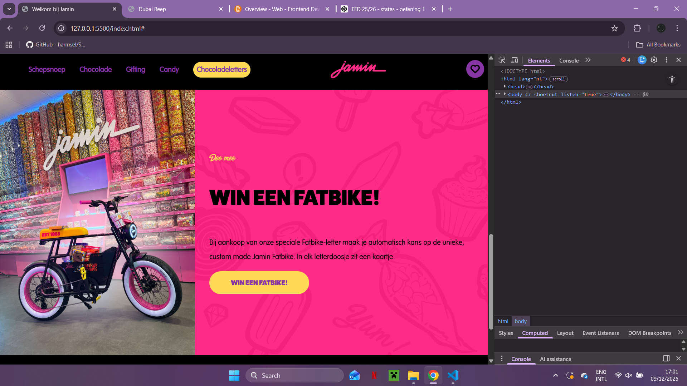

  ### Dit was lastig/Is niet gelukt:
  Uitklapbare informatie "accordion"

  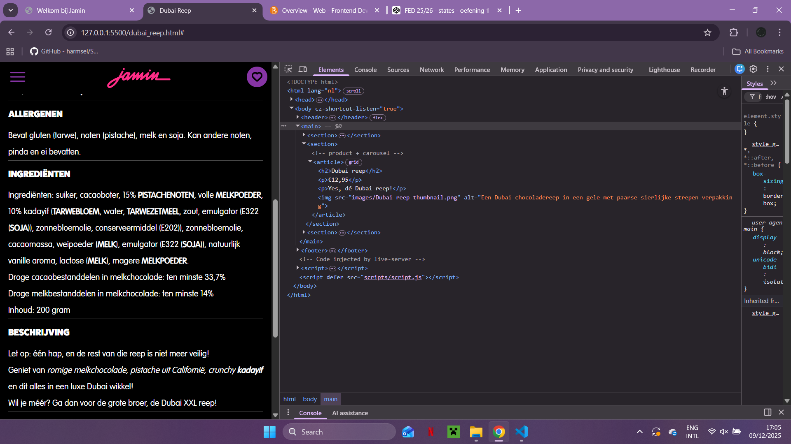
  

## Bronnenlijst

  
continu bijhouden terwijl je werkt

  Nb. Wees specifiek ('css-tricks' als bron is bijv. niet specifiek genoeg). 
  Nb. ChatGpT en andere AI horen er ook bij.
  Nb. Vermeld de bronnen ook in je code.

  1. [bron 1](https://www.w3schools.com/howto/howto_js_accordion.asp)
  2. [bron 2](https://www.a11yproject.com/posts/how-to-hide-content/)
  3. Overige code is geleerd tijdens de werkgroepen 

